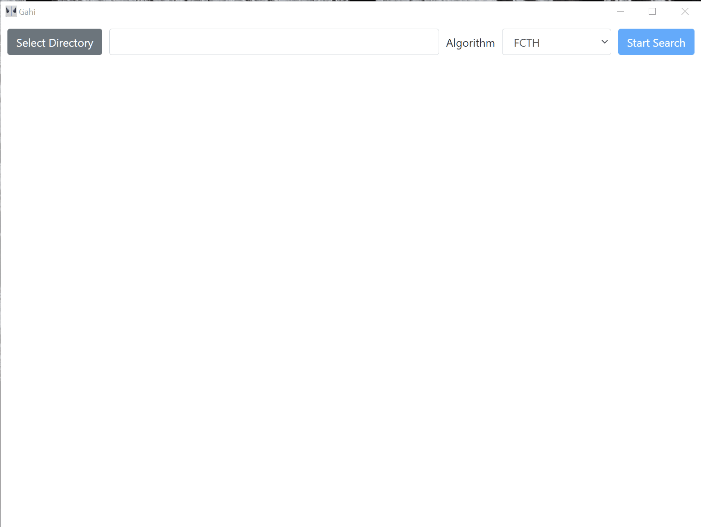
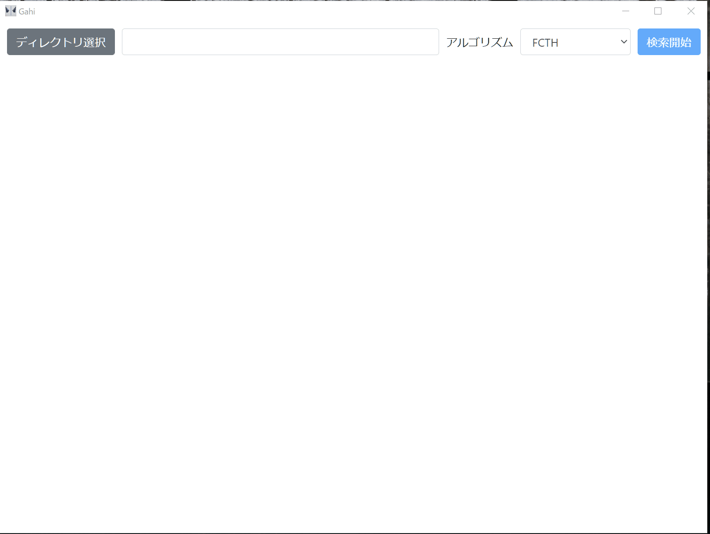

# Gahi

[English](#readme-english) | [日本語](#readme-日本語)

## Readme (English)

This application finds duplicated images in a directory. And you can select and delete some found images.

### Requirements

* Windows
* Java 1.8 or later is installed

### Internal Design

* cli
    * CLI written by Java powered by [LIRE](https://github.com/dermotte/LIRE)
* gui
    * Electron + React + TypeScript. It executes the CLI on relative path internally.

### Download

https://github.com/keshihoriuchi/gahi/releases

## Readme (日本語)

ディレクトリの中から重複した画像を自動で探して表示し、選択した画像をゴミ箱に移動できるアプリケーション。

### 実行要件

* Windows
* Java1.8以上がインストールされている

### ダウンロード

https://github.com/keshihoriuchi/gahi/releases

### 内部設計

* cli
    * [LIRE](https://github.com/dermotte/LIRE) を利用したJavaのCLI
* gui
    * Electron+React+TypeScript。相対パスのCLIを内部的に実行する